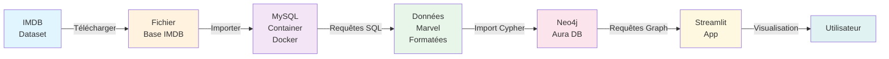

# MoviesDB

Scripts et outils pour manipuler la base de données IMDB, extraire les films Marvel et les analyser via Neo4j avec une interface Streamlit.

## 📋 Jalons du Projet

### 1. 📦 Créer le fichier base de données IMDB
- Télécharger et structurer les données IMDB
- Préparer les fichiers bruts pour l'importation MySQL

### 2. 🐳 Créer un conteneur Docker MySQL et peupler la base
- Lancer un conteneur MySQL via Docker Compose
- Importer les données IMDB dans la base de données
- Vérifier l'intégrité des données

### 3. 🔍 Créer les requêtes SQL pour extraire les films Marvel
- Écrire les requêtes SQL pour identifier et extraire les films Marvel
- Mettre en forme les données pour l'importation dans Neo4j
- Exporter les données en format compatible

### 4. 🌐 Import dans Neo4j Aura DB
- Configurer la connexion à Neo4j Aura
- Importer les données formatées
- Créer les relations entre entités (films, acteurs, réalisateurs, etc.)

### 5. 📊 Création de l'app Streamlit
- Développer une interface web interactive
- Permettre l'exploration des films Marvel via graphes
- Implémenter les visualisations et statistiques

## 📊 Architecture du Projet



## 🚀 Démarrage Rapide

### Prérequis
- Docker et Docker Compose
- Python 3.x
- Accès à Neo4j Aura

### Installation

1. **Lancer la base MySQL** :
```bash
docker-compose up -d
```

2. **Importer les données IMDB** :
```bash
# Voir le notebook d'importation
jupyter notebook notebooks/Creation_newIMDB_Database.ipynb
```

3. **Configurer Neo4j Aura** :
- Créer un compte sur [Neo4j Aura](https://neo4j.com/cloud/aura/)
- Récupérer les identifiants de connexion

4. **Lancer l'application Streamlit** :
```bash
streamlit run app.py
```

## 📁 Structure du Projet

```
MoviesDB/
├── docker/                    # Configuration Docker
│   └── Dockerfile.mysql       # Fichier Docker pour MySQL
├── docker-compose.yml         # Orchestration des conteneurs
├── notebooks/                 # Notebooks Jupyter
│   └── Creation_newIMDB_Database.ipynb
├── utils/                     # Utilitaires et scripts
├── tests/                     # Tests unitaires
├── docs/                      # Documentation
└── requirements.txt           # Dépendances Python
```

## 📝 Notes

- Les identifiants Docker peuvent être modifiés dans `docker-compose.yml`
- Les requêtes SQL sont stockées dans le dossier `utils/`
- Les données sont persistées dans un volume Docker `mysql_data`
